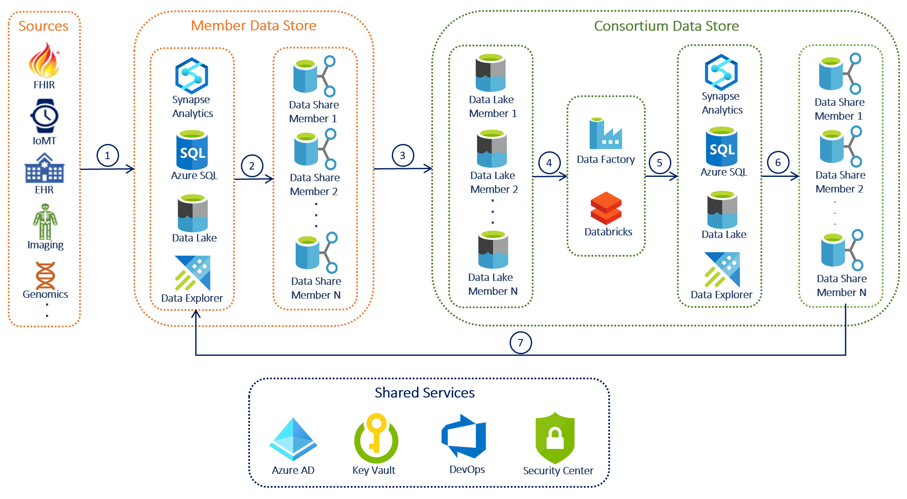

# Health Data Consortium on Azure

## Introductory

Traditional clinical trials can be complex, time consuming and costly. To address this, growing number of healthcare organizations are partnering together to build data consortiums for sharing data and orchestration, while ensuring data security, patient privacy and data interoperability. This could not only offer research data but new revenue stream. This effort will ultimately provide access to data quicker leading to more cost-effective regulatory decisions and accelerated innovation that keeps patients safer and healthier. This architecture could be customized to meet your specific requirements.

## Potential use cases

   - Real world evidence observational data to access patient outcomes and provide the right treatment.
   - Personalized or precision medicine to diagnose, prevent and treat individual patients.
   - Tele-medicine, virtual health applications help access data more easily and improve quality and care to patients.
   - Increase the value of genomic data.

## Architecture

The data flows through the solution as follows:

1. **Data Source to Member Data Store:** Data from various sources whether on-premises or from 3rd party are loaded into one or more the data storage services, including Synapse Analytics, Azure SQL Database, Azure Data Lake Gen2 or Azure Data Explorer in to Members Data Store.
2. **Member as Data Share Producer:** Members, the Data Producers receives a Data Share invitation from Data Consumer Consortium for Snapshot and/or In-Place Sharing to share data from these data storage services.
3. **Consortium as Data Share Consumer:** Consortium, the Data Consumer receives the shared data into Azure Data Lake Gen2 in Consortium Data Share for further transformation.
4. **Consortium Data Transformation:** Data Factory and/or Databricks cleanses and transforms all the Member data into a common format. 
5. **Consortium Data Consolidation:** Combined Member's data is stored in one or more data storage services, including Synapse Analytics, Azure SQL Database, Azure Data Lake Gen2 or Azure Data Explorer depending on the structure and volume.
6. **Consortium as Data Share Producer:** Consortium, the Data Producer receives a Data Share invitation from Data Consumer Members for Snapshot and/or In-Place Sharing to share data.
7. **Member as Data Share Consumer:** Members, the Data Consumers receives the shared data into Member Data Store for further research and analysis.

### Components

Commonly, Healthcare data are on many different platforms:

- EHR (Electronic Heath Records) data 
- [FHIR](https://www.hl7.org/fhir/index.html) (Fast Healthcare Interoperability Resources) data
- IoMT (Internet of Medical Things) data
- [Genomics](https://www.genome.gov/about-genomics/fact-sheets/A-Brief-Guide-to-Genomics) data
- [Imaging](https://www.dicomstandard.org/) data
- Other data from CRM, Billing, 3rd Party systems...

Data is loaded from these different data sources using several Azure components:

- **[Azure Data Share](https://docs.microsoft.com/en-us/azure/data-share/overview)** enables organizations to simply and securely share data with multiple customers and partners. Data providers are always in control of the data that they have shared. Azure Data Share makes it simple to manage and monitor what data was shared, when and by whom. Azure Data Share helps enhance insights by making it easy to combine data from third parties to enrich analytics and AI scenarios. Easily use the power of Azure analytics tools to prepare, process, and analyze data shared using Azure Data Share.

- **[Azure Synapse Analytics](https://docs.microsoft.com/en-us/azure/synapse-analytics/)** is an analytics service that brings together enterprise data warehousing and Big Data analytics. It gives you the freedom to query data on your terms, using either serverless on-demand or provisioned resources—at scale. Dedicated SQL pool (formerly SQL DW) refers to the enterprise data warehousing features that are available in Azure Synapse Analytics.

- **[Azure SQL Database](https://docs.microsoft.com/en-us/azure/azure-sql/database/sql-database-paas-overview)** is a fully managed platform as a service (PaaS) database engine that handles most of the database management functions such as upgrading, patching, backups, and monitoring without user involvement. Supports modern cloud applications on an intelligent, managed database service, that includes serverless compute.

- **[Azure Data Lake Gen2](https://docs.microsoft.com/en-us/azure/storage/blobs/data-lake-storage-introduction)** is massively scalable and secure data lake for your high-performance analytics workloads. Designed from the start to service multiple petabytes of information while sustaining hundreds of gigabits of throughput, Data Lake Storage Gen2 allows you to easily manage massive amounts of data. In this architecture, Azure Data Lake Gen2 can be used store all Member's data into one location for In-Place Sharing of streaming data.

- **[Azure Data Explorer](https://docs.microsoft.com/en-us/azure/data-explorer/)** is a fast, fully managed data analytics service for real-time analysis on large volumes of data streaming from applications, websites, IoT devices, and more. Quickly identify patterns, anomalies, and trends in your data. Run as many queries as you need using the optimized cost structure. In this architecture, Azure Data Explorer can be used for In-Place Sharing of streaming data.

- **[Azure Data Factory](https://docs.microsoft.com/en-us/azure/data-factory/introduction)** is a fully managed, serverless data integration service for scale-out serverless data integration and data transformation. It offers a code-free UI for intuitive authoring and single-pane-of-glass monitoring and management. Create and schedule data-driven workflows (called pipelines) that can ingest data from disparate data stores including  relational, non-relational, and other storage systems.

- **[Azure Databricks](https://docs.microsoft.com/en-us/azure/databricks/scenarios/what-is-azure-databricks)** is a data analytics platform optimized for the Microsoft Azure cloud services platform. Azure Databricks offers two environments for developing data intensive applications: Azure Databricks SQL Analytics and Azure Databricks Workspace. Azure Databricks provides the latest versions of Apache Spark and allows you to seamlessly integrate with open source libraries. Spin up clusters and build quickly in a fully managed Apache Spark environment with the global scale and availability of Azure.

- **[Azure Active Directory](https://docs.microsoft.com/en-us/azure/active-directory/fundamentals/)**  is a multi-tenant, cloud-based identity and access management service.

- **[Azure Key Vault](https://docs.microsoft.com/en-us/azure/key-vault/general/)** is a cloud service for securely storing and accessing secrets such as API keys, passwords, certificates, or cryptographic keys.

- **[Azure DevOps Pipelines](https://docs.microsoft.com/en-us/azure/devops/pipelines/?view=azure-devops)** automatically combines continuous integration (CI) and continuous delivery (CD) to constantly and consistently test and build your code and ship it to any target.

- **[Azure Security Center](https://docs.microsoft.com/en-us/azure/security-center/)** provides unified security management and advanced threat protection across hybrid cloud workloads.

### Alternatives

- Data Share currently supports Azure Synapse Analytics, Azure SQL Database, Azure Data Lake Gen2 and Azure Blob Storage for Snapshot Sharing of batch data, and Azure Data Explorer for In-Place Sharing of streaming telemetry and log data. More data sources will be supported in the future.

- If the datasets are very large, non-relational or not in a common format, consider using Blob or Data Lake Storage when receiving and sending from Data Share instead of Synapse Analytics or Azure SQL Database.

- If Data Share is not a viable option, a site to site VPN could be used to push data from Member Data Store to Consortium Data Store and vice versa.

## Considerations

The technologies in this architecture were chosen because they meet most company's requirements for security, scalability and availability, while helping control costs.

Azure Data Share leverages the underlying [security](https://docs.microsoft.com/en-us/azure/data-share/security) that Azure offers to protect data at rest and in transit. Data is encrypted at rest, where supported by the underlying data store. Data is also encrypted in transit using TLS 1.2. Metadata about a data share is also encrypted at rest and in transit. Azure Data Share does not store contents of the customer data being shared.

## Pricing

Pricing for this architecture is going to be based on the services chosen, the capacity, throughput, transformations done on the data, as well as business continuity and disaster recovery. 

[Customize and get pricing estimates](https://azure.microsoft.com/en-us/pricing/calculator/).

## Next steps

Modify the reference architecture above to fit your specific requirements by answering these questions:
- What and where are your Data sources?
- Which Azure data store(s) will this be data landed in Member Data Store?
- What Member data will be shared with Consortium?
- Which data store(s) will Consortium land the shared data?
- Is the Member data already in common format or needs cleansing and transformation?
- Will the data be shared as batch or Snapshot, or streaming or In-Place? 
- What data will Consortium share with Members?

## Related resources

- [Azure API for FHIR](https://azure.microsoft.com/en-us/services/azure-api-for-fhir/)

- [Azure IoT Connector](https://docs.microsoft.com/en-us/azure/healthcare-apis/overview#iot-connector-preview)

- [Microsoft DICOM](https://github.com/microsoft/dicom-server)

- [Microsoft Genomics](https://azure.microsoft.com/en-us/services/genomics/)

